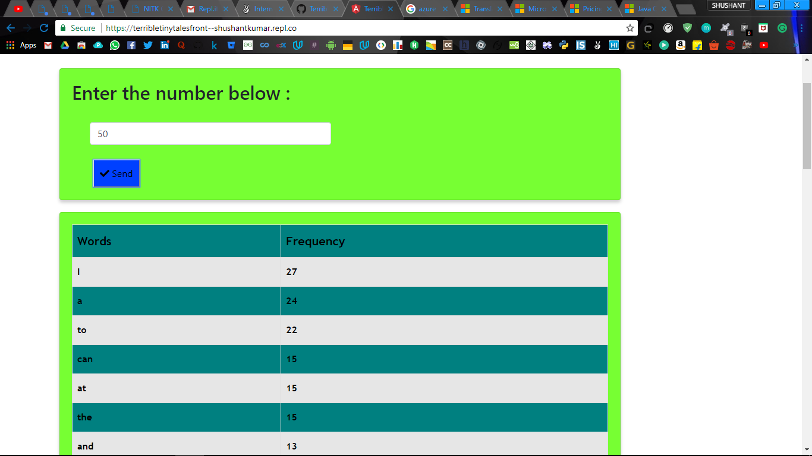

# Terribly Tiny Tales

This project is developed in Angular5 framework for frontend with Bootstrap for styling, the backend is a API developed in NodeJs with ExpressJs as framework and Repl.it platform is used for hosting the application.<br>

The site url for frontend is - <a href="https://terribletinytalesfront--shushantkumar.repl.co/">https://terribletinytalesfront--shushantkumar.repl.co/</a><br>
The site url for backend API is - <a href="https://terribletinytales--ShushantKumar.repl.co">https://terribletinytales--ShushantKumar.repl.co</a><br>  

In this project a number N can be entered by the user and when the user presses Send button a request is made to the backend API which returns the top N most frequently occurring words in the file available at <a href="http://terriblytinytales.com/test.txt">http://terriblytinytales.com/test.txt</a>. The received words with their frequency is displayed in  tabular column in the frontend.<br>

### Steps

1. Clone the repository


    ```
        git clone https://github.com/shushantkumar/Terribly-Tiny-Tales.git
    ```
2. Move into the directory  
    
    ```
        cd Terribly-Tiny-Tales
    ```       
3. To start the server type the below commands 
    
    ```
        cd TTT-Backend-API
        node server.js
    ```       
    Local server will be running at localhost:8000
    Hosted server running at https://terribletinytales--ShushantKumar.repl.co/
4. To start the frontend type the below commands 
    
    ```
        cd TTT-Frontend
        ng serve
    ```       
    Web Application will be running at localhost:4200
    Hosted Web Application running at https://terribletinytalesfront--shushantkumar.repl.co/

### Componenets of the code

* The frontend main code is at TTT-Frontend/src/app/main. It comprises of main.component.html, main.component.scss, main.component.spec.ts and main.component.ts file. The HTML code is in .html file. It has a basic header and a form with just one field which is a number N and button to submit the form. Then there is a table at bottom which is initialized after the send button is clicked and all the fields are displayed in tabular format using ngFor. On clicking the button "send" a function postN() is invoked from component.ts file.
    
    FRONTEND MAIN CODE
    ```
    postN(event){
    	console.log("started");
    	event.preventDefault();
    	let data = {"val_n":this.val_n};
    	let specificUrl = "https://terribletinytales--ShushantKumar.repl.co";
    	let headers =  {headers: new  HttpHeaders({ 'Content-Type':  'application/json'})};
    	console.log(data);
    	this.http.post(specificUrl, data,headers).subscribe(
    		(res) => {console.log(res);
    			this.nFreq=res;
    				},
    		(err) => console.log(err),
    		() => console.log('done!')
    		);
    	}
    ```       
  * In the above code under main.component.ts file we are getting our data from html page in the variable val_n. Then I made into a json type and stored it in variable data. specificUrl variable stores the server address where the frontend requests the service. headers variable stores the content-type which is Json in this case. Then we send these variables as parameters as POST request to backend API and the response returned is stored in res variable. The global variable nFreq is then assigned to the response and the HTML takes this variable and displays in the Webpage as table using ngFor loop.

  * The external Modules used are FormsModule for binding variable using [ngModel], HttpClientModule for sending the post request to API server. 

  * The backend code is at TTT-Backend-API/server.js . 

    ```
    // The route and type of request here 	
        app.route('/').post((req, res) => {
        	 const url = 'http://terriblytinytales.com/test.txt';
        	 fetch(url)
        	 .then((resp) => resp.text())
        	 .then((body) => {
        	 	var temp = body;
        	 	var words = new Array();
        	 	words = temp.split(" ");

      // sort by count in descending order
      function sortByCount (wordsMap) {
      var finalWordsArray = [];
    finalWordsArray = Object.keys(wordsMap).map(function (key) {
    return {
      name: key,
      total: wordsMap[key]
    };  });
    finalWordsArray.sort(function (a, b) {
    return b.total - a.total;
      });
      return finalWordsArray;}


    // Creating a wordmap
    function createWordMap (wordsArray) {
      var wordsMap = {};
      wordsArray.forEach(function (key) {
    if (wordsMap.hasOwnProperty(key)) {
      wordsMap[key]++;
    } else {
      wordsMap[key] = 1;
    }  });
    return wordsMap;}

      // Main execution
      var wordsArray = words;
      var wordsMap = createWordMap(wordsArray);
      var finalWordsArray = sortByCount(wordsMap); 
      var finResp = new Array();      
      for(var i=0;i<req.body.val_n;i++){
        	finResp[i] = [finalWordsArray[i].name,finalWordsArray[i].total];
        	  }
       console.log(finResp); 
       res.status(201).send(finResp);
       console.log("Sent");
      });
     
    ```       

* Going step by step first we fetch the data from url as specified and store it in variable body. We split the whole text into words using .split(" ") function of javascript. Then there are two functions one createWordMap which creates key pair value with key as the words and pair as the number of occurences. All the words are accessed one by one from the set of words separated after tokenizing from the text. The other function sortByCount takes the map created as input and sorts the key pair on the basis of maximum pair value at the top by comparing with every key-pair values. It returns the sorted key-pair map. Then I took this variable and stored it in finalWordsArray variable and iterated in a loop for the number of times as received from client side and forms a list of words and frequency and returns it to the client.

* Express framework was used with node-fetch and cors. node-fetch was used for fetch function to get data from url mentioned and cors was used to allow cross origin resource sharing access. No external modules were used for frequency calculation.

### The Test cases with data and screenshot is placed below

* Startup screen is as below
 
<br>

* User can enter the number N and press Send and below the result is dispalyed , N = 15 

<br>

<br>

* N= 50 the top and bottom screenshots

<br>

<br>

